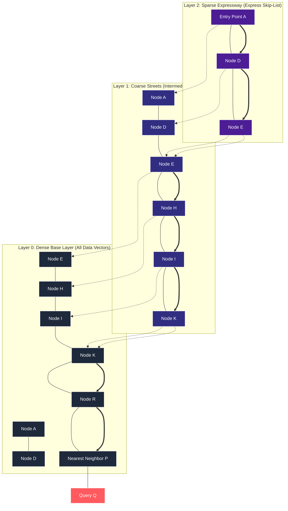
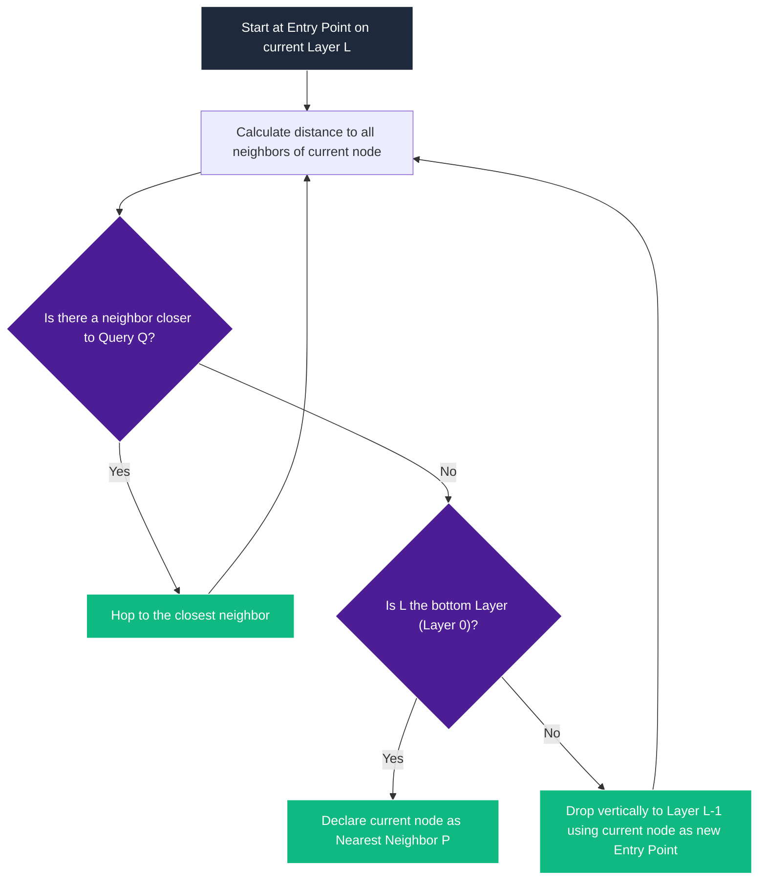
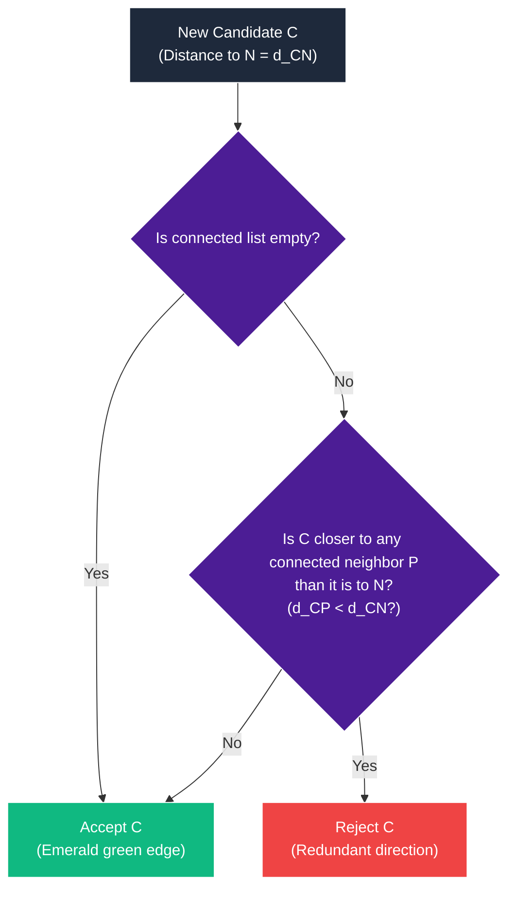
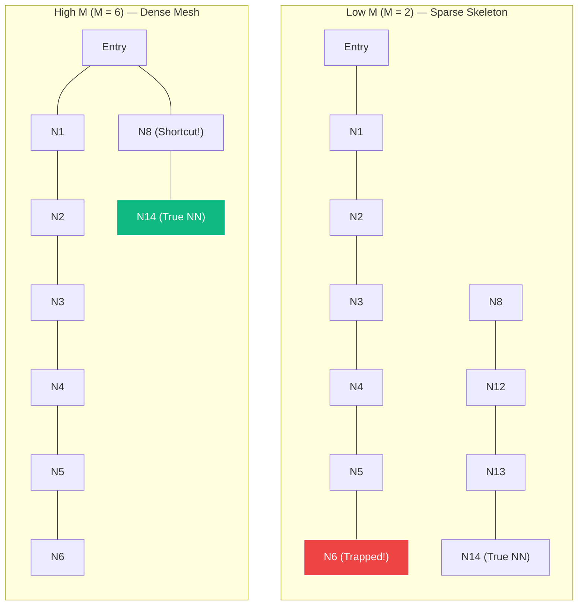

# The Visual, Intuitive Guide to HNSW (Hierarchical Navigable Small World)

If you have ever queried a vector database (like Milvus, Qdrant, Pinecone, pgvector, or FAISS), you have leveraged the power of **HNSW (Hierarchical Navigable Small World)** under the hood. It is the gold standard for Approximate Nearest Neighbor (ANN) search, retrieving a needle-in-a-haystack vector out of millions of high-dimensional embeddings in **microseconds** with astonishing recall.

In a flat vector space, finding the nearest neighbor requires a linear scan—comparing your query to *every single vector* in the database ($\mathcal{O}(N)$ complexity). HNSW turns this into a logarithmic highway traversal ($\mathcal{O}(\log N)$), resolving queries with absolute mathematical elegance.

This comprehensive guide breaks down the three core pillars of HNSW: **how the graph is searched**, **how the graph is built step-by-step**, and **how to fine-tune its hyperparameters in production**.

---

## The Core Architecture: A Skip-List for Graphs

Before we look at routing and graph construction, let's understand the physical structure of HNSW. HNSW is inspired by the **skip-list**—a probabilistic data structure that allows fast search in sorted lists by maintaining multiple layers of linked lists with increasing sparsity.

HNSW translates this multi-tiered indexing concept into a vertically stacked set of graph layers:



* **Layer 2 (Top)**: Extremely sparse. Only a tiny fraction of nodes exist here. This is the **expressway** where a searcher can make massive, long-range jumps across the vector space.
* **Layer 1 (Middle)**: Coarser street map. Features moderate connectivity to narrow down the search neighborhood.
* **Layer 0 (Bottom)**: The dense ground truth. Every single data point in your dataset lives here.

Each node that exists on a higher layer is duplicated on all layers below it, linked vertically by stable coordinate connectors.

---

## PART 1: The Search Routing (Greedy Walk)

The search routing relies on a highly optimized **Greedy Walk**. At each node, the searcher calculates the distance between the query point $Q$ and all connected neighbors of the current node. It only moves if it finds a neighbor that is *strictly closer* to $Q$ than the current node.



### Step-by-Step Traversal Walkthrough

Let’s trace the exact search routing trajectory from our **HNSW Search Animation** where our Target Query Point **$Q$** is located at coordinates **$[3.0, -2.0]$**.

#### 1. Sparse Top Layer (Layer 2)
The searcher initiates the traversal at **Node $A$** (the entry point for the top layer).
* **At Node $A$** ($[-3.0, 2.5]$, distance to $Q \approx 7.50$):
  * Probes neighbor **$D$** ($[-1.0, 2.0]$, distance to $Q \approx 5.66$).
  * Since $5.66 < 7.50$ (closer), the searcher hops: **$A \to D$**.
* **At Node $D$** ($[-1.0, 2.0]$):
  * Probes neighbor **$E$** ($[-0.5, 0.5]$, distance to $Q \approx 4.30$).
  * Since $4.30 < 5.66$ (closer), the searcher hops: **$D \to E$**.
* **At Node $E$** ($[-0.5, 0.5]$):
  * Probes neighbors **$D$** ($5.66$) and **$X$** ($[-2.0, -1.0]$, distance to $Q \approx 5.10$).
  * None of the neighbors are closer than $E$'s current distance of $4.30$.
  * **Local Minimum Reached**: The searcher halts at $E$ and declares it the local minimum on $L_2$.
  
*Search cost on Layer 2:* **2 hops**.

#### 2. Refinement on Layer 1
The searcher drops vertically from Node $E$ on Layer 2 to Node $E$ on Layer 1. The camera zooms in around $E$ to reveal coarser local connections.
* **At Node $E$** ($[-0.5, 0.5]$):
  * Probes neighbors **$D$** ($5.66$), **$X$** ($5.10$), and **$H$** ($[0.5, 0.2]$, distance to $Q \approx 3.33$).
  * Since $3.33 < 4.30$, the searcher hops to the closest neighbor: **$E \to H$**.
* **At Node $H$** ($[0.5, 0.2]$):
  * Probes neighbor **$I$** ($[1.2, -0.4]$, distance to $Q \approx 2.41$).
  * Since $2.41 < 3.33$, the searcher hops: **$H \to I$**.
* **At Node $I$** ($[1.2, -0.4]$):
  * Probes neighbor **$K$** ($[1.8, -0.6]$, distance to $Q \approx 1.84$).
  * Since $1.84 < 2.41$, the searcher hops: **$I \to K$**.
* **At Node $K$** ($[1.8, -0.6]$):
  * Probes neighbors **$I$** ($2.41$), **$Y$** ($[1.0, -1.5]$, distance to $Q \approx 2.06$), and **$Z$** ($[2.5, 0.5]$, distance to $Q \approx 2.55$).
  * None of these neighbors are closer than $K$'s current distance of $1.84$.
  * **Local Minimum Reached**: The searcher stops at $K$ on Layer 1.

*Search cost on Layer 1:* **3 hops**.

#### 3. Dense Base Layer (Layer 0)
The searcher drops vertically from $K$ on Layer 1 to $K$ on Layer 0. The camera zooms in significantly to reveal the dense, cluttered ground-truth graph.
* **At Node $K$** ($[1.8, -0.6]$):
  * Probes neighbors **$I$** ($2.41$), **$Y$** ($2.06$), **$Z$** ($2.55$), and **$R$** ($[2.4, -1.2]$, distance to $Q \approx 1.00$).
  * Since $1.00 < 1.84$, the searcher hops: **$K \to R$**.
* **At Node $R$** ($[2.4, -1.2]$):
  * Probes neighbor **$P$** ($[2.7, -1.6]$, distance to $Q \approx 0.50$).
  * Since $0.50 < 1.00$, the searcher hops: **$R \to P$**.
* **At Node $P$** ($[2.7, -1.6]$):
  * Probes neighbors **$R$** ($1.00$) and **$C_6$** ($[3.0, 1.0]$, distance to $Q \approx 3.00$).
  * None of the neighbors are closer than $0.50$.
  * **Global Nearest Neighbor Isolated**: The searcher declares **Node $P$** as the final nearest neighbor to $Q$!

*Search cost on Layer 0:* **2 hops**.  
*Total search path cost:* **7 hops** (only 14 nodes evaluated in total out of the entire database!).

---

## PART 2: The Graph Build & The Diversity Heuristic

Now we explore the construction phase: **how does HNSW build this magical self-balancing graph?**

### Phase 1: Roll the Dice (Layer Selection)

When a new vector **N** is inserted, HNSW must decide: **what is the highest layer this node should exist on?**

To maintain logarithmic query bounds, we use a loaded die governed by **exponential decay**. The maximum layer $L_{\max}$ is determined by a logarithmic formula:

$$L_{\max} = \left\lfloor -\ln(u) \cdot m_L \right\rfloor$$

Where:
* $u$ is a random decimal drawn uniformly between $0$ and $1$ ($u \sim \text{Uniform}(0, 1)$).
* $m_L$ is a normalization parameter (often set to $1/\ln(M)$) that controls the decay rate.

#### The Loaded Die in Action
If we roll the dice and draw $u = 0.25$ (with $m_L = 1.0$), we calculate:

$$L_{\max} = \lfloor -\ln(0.25) \cdot 1.0 \rfloor = \lfloor 1.386 \rfloor = 1$$

Because of the natural logarithm ($-\ln(u)$), the probability of landing on a layer decreases exponentially:
* ~63% of nodes get assigned only to **Layer 0**.
* ~25% of nodes reach **Layer 1**.
* ~8% of nodes reach **Layer 2**.
* Less than ~3% ever reach **Layer 3**.

This keeps higher layers sparse and bounds the search complexity to $\mathcal{O}(\log N)$. In our animation, Node **N** rolls $u = 0.25$, landing on **Layer 1** as its maximum layer.

---

### Phase 2: The Greedy Walk (Routing Downwards)

Now that we know Node N belongs on Layer 1, we must find where to insert it.
1. **Start at the Top Entry Point**: The searcher starts at the entry point of the absolute highest layer (Node **E** on Layer 2).
2. **Greedy Traversal**: The searcher probes all neighbors of E on Layer 2, calculating their distance to N.
3. **Vertical Drop**: E is the only node on Layer 2, so it is the local minimum. The searcher drops straight down the vertical link to Node **E** on Layer 1.

The searcher is now perfectly positioned on Layer 1, ready to evaluate candidates for N's connections.

---

### Phase 3: The Secret Sauce (The HNSW Diversity Heuristic)

This is the most critical phase of HNSW. Node N has arrived on Layer 1, and we need to choose which existing nodes it should connect to. 

Suppose we want to connect N to $M = 2$ neighbors. We search the neighborhood of N and find the 3 closest candidates:
1. **Node P** (distance $d = 0.90$)
2. **Node E** (distance $d = 1.12$)
3. **Node Q** (distance $d = 1.12$)

```txt
          [Node E] (0,0)
             \
              \ d=1.12
               \
  [Node P] ---- (Node N) ---------- [Node Q]
  (0.1,-0.6)  d=0.90 (1.0,-0.5)      d=1.12  (2.0,-1.0)
```

#### The Naive Proximity Trap
A simple nearest-neighbor algorithm would pick the two absolute closest points: **Node P** ($0.90$) and **Node E** ($1.12$).

But look at the spatial layout! **Node P and Node E both lie in the exact same direction (left of N).** If we connect only to P and E, all of N's edges point to the left. The graph becomes **clustered**. If a future searcher approaches from the right, they will have no way to cross N to get to the left side because there are no bridging connections.

#### The HNSW Diversity Heuristic
To keep the graph globally navigable, HNSW uses a **diversity heuristic** instead of naive proximity. The core algorithm acts as a decision tree evaluated sequentially for each neighbor candidate:



We evaluate the candidates sequentially (sorted by distance to N):
1. **Evaluate Candidate P (d = 0.90)**:
   * Since no connections have been made yet, **P is accepted**. Our first edge is **N-P**.
2. **Evaluate Candidate E (d = 1.12)**:
   * We check if E is closer to our already connected neighbor P than it is to N.
   * We calculate: $d(E, P) \approx 0.61$.
   * Since $d(E, P) = 0.61 < d(E, N) = 1.12$, **E is closer to P than N**.
   * This connection is redundant! If N needs to talk to E, it can just go through P. **E is rejected.**
3. **Evaluate Candidate Q (d = 1.12)**:
   * We check if Q is closer to our connected neighbor P than to N.
   * We calculate: $d(Q, P) \approx 1.94$.
   * Since $d(Q, P) = 1.94 > d(Q, N) = 1.12$, **Q is farther from P**.
   * This means Q points in a completely different, unexplored direction! Connecting to Q adds immense structural diversity. **Q is accepted.**

#### The Result: A Bounded, Navigable Highway
By rejecting the closer point **E** and accepting the farther point **Q**, HNSW wires N to **P** and **Q**. Instead of two clustered leftward edges, we get a beautiful bridge linking the left and right regions of the graph:

```txt
  [Node P] <====== (Node N) ======> [Node Q]
```

This single heuristic is why HNSW graphs remain highly navigable small worlds with short paths, preventing routing searchers from getting trapped in local coordinate pockets.

---

### Phase 4: Base Layer Connection & Pruning

After establishing connections on Layer 1, Node N and the searcher drop to **Layer 0 (the bottom layer)**. On Layer 0, the exact same process is repeated but at a higher density. The searcher greedily gathers nearest neighbors, and Node N establishes connections to candidates (e.g. `{P, Q, A, C}`).

#### The Degree Budget (Pruning)
To keep memory bounded and search fast, HNSW enforces a strict budget: **no node can exceed $M$ connections on Layer 0.**

What happens if our new connections push an existing node over its budget?
* During our insert, Node **P** gets wired to N.
* This addition gives Node P a total of **5 connections**, exceeding its budget of $M = 4$.
* To fix this, HNSW runs the **diversity heuristic again** specifically on P's 5 connected neighbors.
* It calculates that the edge between **P and D** is the most redundant (highly clustered with existing paths).
* The edge **P-D** is pruned: it wiggles, cracks, and fades away.

By actively pruning redundant edges during insertion, HNSW guarantees that the graph stays sparse, bounded, and extremely fast to traverse.

---

## PART 3: Tuning HNSW (Hyperparameters)

You could run HNSW right out of the box using default values—but defaults are just a generic compromise. Two numbers control the physical architecture of the graph, and one controls how aggressively it is searched. Change them, and you get a completely different search engine.

### The Vector Search Trade-off Triangle

Vector search is governed by an inescapable three-way trade-off:

```txt
               [ Search Latency (Speed) ]
                        /     \
                       /       \
                      /  HNSW   \
                     /  Tuning   \
                    /    Space    \
                   /               \
[ Recall Accuracy ] ----------------- [ Memory & Build Time ]
```

1. **Recall Accuracy**: The percentage of queries that successfully return the true, mathematically absolute nearest neighbors.
2. **Search Latency (Speed)**: How many queries your database can execute per second (QPS).
3. **Memory & Build Time**: The RAM footprint of the index and the time it takes to build the graph.

---

### The Tuning Knobs (The Dashboard)

```txt
+-------------------------------------------------------------+
|                     HNSW CONTROL PANEL                      |
|                                                             |
|  [M] (Max Connections)    O-------=============  [ M = 16 ] |
|  -> Controls graph skeleton and edge density.                |
|                                                             |
|  [ef] (Search Beam Size)  -O-------------------  [ ef = 10 ]|
|  -> Controls candidate queue size.                          |
|     - ef_construction : queue size during index building    |
|     - ef_search       : queue size during active queries    |
+-------------------------------------------------------------+
```

#### $M$ (Max Connections per Node)
Defines the hard budget of maximum bi-directional connections each node can form on the base layer (Layer 0). High layers automatically receive a budget of $M_{\max} = 2M$.
* **Typical Range**: `2` to `64` (defaults usually hover around `16`).

#### $ef$ (Candidate Queue Size)
The size of the sorted priority queue that holds unexplored candidate nodes during graph traversal.
* **$ef_{\text{construction}}$**: The queue size used **during index building**. It determines how thoroughly a new vector searches the graph to find its entry connections.
* **$ef_{\text{search}}$**: The queue size used **during query time**. It controls the "beam width" of the active nearest neighbor search.
* **Typical Range**: `1` to `500`+.

---

### 1. The $M$ Parameter — Edge Density & Shortcuts

To see the physical effect of $M$, we conduct a split-screen comparison. We insert the **exact same 15 data points** into two databases and run an identical query $Q$. The only difference is the connection budget $M$:



#### Low M ($M=2$): The Sparse Highway Trap
With $M=2$, each node is extremely limited. The resulting graph is a series of long, isolated coordinate chains.
* **The Searcher’s Walk**: Starting at the `Entry` node, the searcher has no choice but to step slowly down the chain: `Entry -> N1 -> N2 -> N3 -> N4 -> N5 -> N6`.
* **The Failure**: At node `N6`, the searcher halts because all its neighbors are farther from query $Q$ than `N6` itself. The searcher is trapped in a **local minimum**, completely unaware that the true nearest neighbor (`N14`) is sitting just across a small gap.
* **Trade-off**: Minimal RAM footprint, but high risk of recall failure due to isolated neighborhoods.

#### High M ($M=6$): Long-Range Shortcuts
With $M=6$, nodes can form multiple edges, weaving a densely connected small-world mesh.
* **The Searcher’s Walk**: Starting at the same `Entry` node, the searcher immediately detects a long-range shortcut edge to `N8` and leaps across the graph: `Entry -> N8`.
* **The Success**: From `N8`, the searcher forms an edge directly to `N14` (the true nearest neighbor). The target is found in exactly **2 hops**!
* **Trade-off**: High recall and lightning-fast search routing, but at the cost of higher memory consumption and slower edge-distance calculations (since every step evaluates 6 neighbor vectors instead of 2).

---

### 2. The $ef_{\text{search}}$ Parameter — Greedy vs. Beam Search

Next, we look at the search effort parameter, $ef_{\text{search}}$. To make the visual comparison perfect, we run the search on two **completely identical graphs** blocked by a crescent barrier. Our target query $Q$ sits in the pocket behind the barrier:

```txt
               (Entry)
               /  |  \
              /   |   \
            (B1) (B2) (B4)
             \    |    /
              \   |   /
                (B3) <--- Crescent Center (Local Minimum)


               (TrueNN) <--- Query Q is here!
```

#### Greedy Search ($ef_{\text{search}} = 1$)
* **The Mechanics**: With $ef=1$, the candidate priority queue can hold at most **1 item**. The searcher is strictly greedy—it evaluates neighbors, chooses the absolute closest, and instantly discards the rest.
* **The Trap**: The searcher steps from `Entry` to `B3` (the tip of the crescent). Once at `B3`, it probes its neighbors `B2` and `B4`. Because the crescent curves away from the target, both `B2` and `B4` are farther from query $Q$ than `B3` is.
* **The Halt**: Since no neighbor is closer than `B3`, and the queue capacity is 1, the searcher has no memory of alternate routes. It stops dead at `B3`. **Recall fails**.

#### Beam Search ($ef_{\text{search}} = 4$)
* **The Mechanics**: With $ef=4$, the searcher maintains a sorted candidate queue holding up to **4 candidates**.
* **The Queue Walk**:
  1. From `Entry`, the searcher probes the crescent. It pushes all neighbors to the queue. The queue sorts them: `[B3: d=2.10, B2: d=2.40, B4: d=2.40, B1: d=3.20]`.
  2. The searcher pops the closest candidate `B3` and moves to it.
  3. At `B3`, it probes neighbors and realizes they are further. Under greedy search, this was the end. But here, the candidate queue still holds `B2`, `B4`, and `B1`!
  4. **The Backtrack**: The algorithm pops `B3` from the queue, immediately backtracks to the next best candidate (`B2`), and jumps there.
  5. From `B2`, it probes `C1` (which is closer to $Q$, bypassing the crescent tip).
  6. The searcher flows smoothly around the barrier: `B2 -> C1 -> C2 -> TrueNN`.
* **The Success**: The true nearest neighbor is found by using a live queue memory to escape a local minimum.

---

### The Ultimate HNSW Tuning Cheat Sheet

Use this reference table to map out your index configurations based on your business requirements:

| Parameter | Tuning Action | Effect on Recall | Effect on Latency (Speed) | Effect on Memory / Build | Practical Use Case |
| :--- | :--- | :--- | :--- | :--- | :--- |
| **$M$** | **Increase ↑**<br/>*(e.g., 32–64)* | **High Increase**<br/>(fewer local minima) | **Moderate Speedup**<br/>(more shortcut paths) | **High Cost**<br/>(more RAM per node) | **High-Dimensional Embeddings**<br/>(Image/Video retrieval, complex cross-attention) |
| **$M$** | **Decrease ↓**<br/>*(e.g., 4–8)* | **Decrease**<br/>(isolated neighborhoods) | **Slower Routing**<br/>(longer paths) | **High Savings**<br/>(sleek index footprint) | **Edge Devices / Low RAM**<br/>(mobile apps, massive sparse document indices) |
| **$ef_{\text{construction}}$** | **Increase ↑**<br/>*(e.g., 200–400)* | **Increase**<br/>(high-quality wiring) | **Slight Speedup**<br/>(better graph routing) | **Slower Build Time**<br/>(long indexing runs) | **Static / Read-Heavy Indices**<br/>(offline product catalogs, curated encyclopedias) |
| **$ef_{\text{construction}}$** | **Decrease ↓**<br/>*(e.g., 32–64)* | **Decrease**<br/>(poor graph quality) | **Slight Increase**<br/>(convoluted search paths) | **Ultra-Fast Indexing**<br/>(near instant builds) | **Dynamic / Write-Heavy Indices**<br/>(real-time streaming feeds, news index) |
| **$ef_{\text{search}}$** | **Increase ↑**<br/>*(e.g., 64–200)* | **Increase**<br/>(exhaustive search) | **High Cost**<br/>(lower queries/sec) | **No RAM Cost**<br/>(temporary query memory) | **High-Precision Retrieval**<br/>(financial audit logs, legal RAG search engines) |
| **$ef_{\text{search}}$** | **Decrease ↓**<br/>*(e.g., 10–32)* | **Decrease**<br/>(greedy traps) | **Ultra-Fast**<br/>(massive QPS speedup) | **No RAM Cost** | **Low-Latency Search**<br/>(search autocomplete, real-time recommenders) |

---

## Conclusion: The Architecture of Tunable Genius

The power of HNSW does not lie in a single, rigid graph layout. **It lies in its flexibility.**

By tuning $M$, $ef_{\text{construction}}$, and $ef_{\text{search}}$, you are in complete control of the trade-off boundaries. You can construct a dense, high-quality skeleton, and then dial $ef_{\text{search}}$ up or down dynamically depending on whether your server is experiencing high traffic (requiring speed) or quiet hours (allowing maximum precision).

Visualizing this graph-building and search routing process makes it obvious why HNSW is so dominant. It is not just a collection of nodes and lines—it is a meticulously engineered, self-balancing, multi-layered transport network for high-dimensional data.
