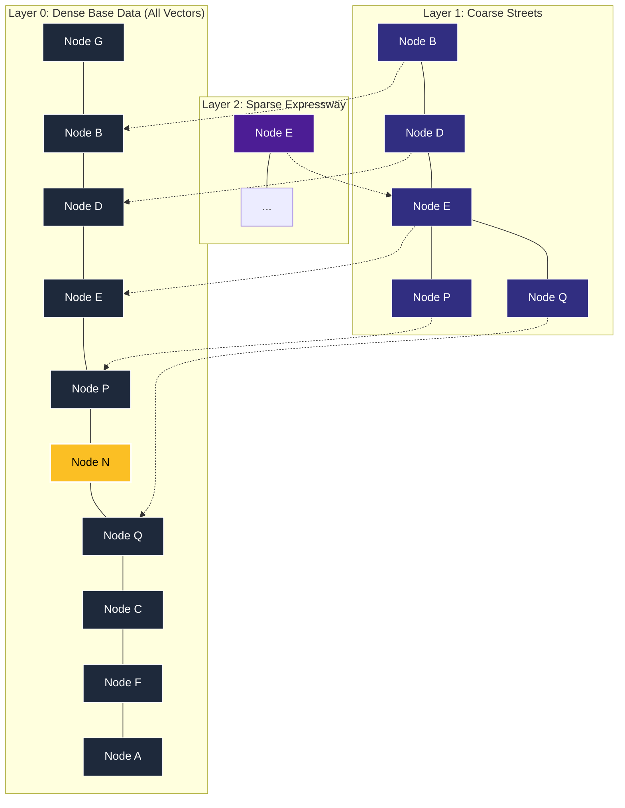
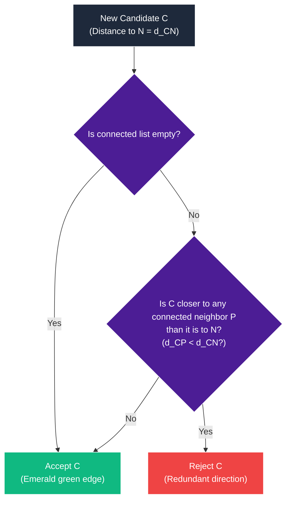

# Demystifying HNSW: How Hierarchical Navigable Small World Graphs are Built

If you've ever queried a vector database (like Milvus, Qdrant, Pinecone, or pgvector), you've used **HNSW (Hierarchical Navigable Small World)** under the hood. It is the gold standard for Approximate Nearest Neighbor (ANN) search, handling millions of high-dimensional queries in milliseconds with astonishing recall.

But how does it actually build this magical graph?

In our accompanying animation, we visualised the exact step-by-step journey of inserting a new node into an HNSW index. This article breaks down what is happening behind the scenes, diving deep into the mathematics, the routing, and HNSW's secret sauce: **the diversity-promoting connection heuristic.**

---

## The Core Concept: A Skip-List for Graphs

Before we look at the construction, let’s understand the world we are building in. HNSW is inspired by the **skip-list**—a probabilistic data structure that allows fast search in sorted lists by maintaining multiple layers of linked lists with increasing sparsity.

HNSW translates this concept to graphs. It maintains a vertically stacked set of layers:



- **Layer 2 (Top)**: Extremely sparse. Only a tiny fraction of nodes exist here. This is the **expressway** where a searcher can make massive, long-range jumps across the vector space.
- **Layer 1 (Middle)**: Coarser street map. Features moderate connectivity to narrow down the search neighborhood.
- **Layer 0 (Bottom)**: The dense ground truth. Every single data point in your dataset lives here.

Each node that exists on a higher layer is duplicated on all layers below it, linked vertically by dashed coordinate connectors.

---

## Phase 1: Roll the Dice (Layer Selection)

When a new vector **N** is inserted, HNSW must decide: **what is the highest layer this node should exist on?**

If we let nodes choose their layers purely at random, we might end up with too many nodes at the top (slowing down the expressway) or too few (making searchers hit a wall). HNSW solves this using **exponential decay**.

The maximum layer $L_{\max}$ is determined by a logarithmic formula:

$$L_{\max} = \left\lfloor -\ln(u) \cdot m_L \right\rfloor$$

Where:

- $u$ is a random decimal drawn uniformly between $0$ and $1$ ($u \sim \text{Uniform}(0, 1)$).
- $m_L$ is a normalization parameter (often set to $1/\ln(M)$) that controls the decay rate.

### The Loaded Die

If we roll the dice and draw $u = 0.25$ (with $m_L = 1.0$), we calculate:

$$L_{\max} = \lfloor -\ln(0.25) \cdot 1.0 \rfloor = \lfloor 1.386 \rfloor = 1$$

Because of the natural logarithm ($-\ln(u)$), the probability of landing on a layer decreases exponentially:

- ~63% of nodes get assigned to **Layer 0**.
- ~25% of nodes reach **Layer 1**.
- ~8% of nodes reach **Layer 2**.
- Less than ~3% ever reach **Layer 3**.

This logarithmic distribution is what keeps the search complexity bound to $\mathcal{O}(\log N)$. In our animation, Node **N** rolls a $u = 0.25$, landing on **Layer 1** as its maximum layer.

---

## Phase 2: The Greedy Walk (Routing Downwards)

Now that we know Node N belongs on Layer 1, we must find where to insert it. We cannot just dump it anywhere; we need to find the nodes on Layer 1 that are closest to N.

HNSW accomplishes this by starting a **greedy search** from the top of the stack:

1. **Start at the Top Entry Point**: The searcher starts at the entry point of the absolute highest layer (Node **E** on Layer 2).
2. **Greedy Traversal**: The searcher probes all neighbors of E on Layer 2, calculating their distance to N. If any neighbor is closer to N than E is, the searcher hops to it.
3. **Hitting a Local Minimum**: If no neighbors are closer to N than the current node, we have hit a **local minimum**. The searcher stops.
4. **Vertical Drop**: Since Node E is the only node on Layer 2, it is trivially the local minimum. The searcher then drops straight down the vertical dashed link to Node **E** on Layer 1.

The searcher is now perfectly positioned on Layer 1, ready to evaluate candidates for N's connections.

---

## Phase 3: The Secret Sauce (The HNSW Diversity Heuristic)

This is the most critical phase of HNSW. Node N has arrived on Layer 1, and we need to choose which existing nodes it should connect to.

Suppose we want to connect N to $M = 2$ neighbors. We search the neighborhood of N and find the 3 closest candidates:

1. **Node P** (distance $d = 0.90$)
2. **Node E** (distance $d = 1.12$)
3. **Node Q** (distance $d = 1.12$)

```txt
          [Node E] (0,0)
             \
              \ d=1.12
               \
  [Node P] ---- (Node N) ---------- [Node Q]
  (0.1,-0.6)  d=0.90 (1.0,-0.5)      d=1.12  (2.0,-1.0)
```

### The Naive Proximity Trap

A simple nearest-neighbor algorithm would pick the two absolute closest points: **Node P** ($0.90$) and **Node E** ($1.12$).

But look at the spatial layout! **Node P and Node E both lie in the exact same direction (left of N).** If we connect only to P and E, all of N's edges point to the left. The graph becomes **clustered**. If a future searcher approaches from the right, they will have no way to cross N to get to the left side because there are no bridging connections.

### The HNSW Diversity Heuristic

To keep the graph globally navigable, HNSW uses a **diversity heuristic** instead of naive proximity. The core algorithm acts as a decision tree evaluated sequentially for each neighbor candidate:



It maintains a queue of candidates sorted by distance to N, and evaluates them sequentially:

1. **Evaluate Candidate P (d = 0.90)**:
   - Since no connections have been made yet, **P is accepted**. Our first edge is **N-P**.
2. **Evaluate Candidate E (d = 1.12)**:
   - We check if E is closer to our already connected neighbor P than it is to N.
   - We calculate: $d(E, P) \approx 0.61$.
   - Since $d(E, P) = 0.61 < d(E, N) = 1.12$, **E is closer to P than N**.
   - This means N's connection to E is redundant! If N needs to talk to E, it can just go through P. **E is rejected.**
3. **Evaluate Candidate Q (d = 1.12)**:
   - We check if Q is closer to our connected neighbor P than to N.
   - We calculate: $d(Q, P) \approx 1.94$.
   - Since $d(Q, P) = 1.94 > d(Q, N) = 1.12$, **Q is farther from P**.
   - This means Q points in a completely different, unexplored direction! Connecting to Q adds immense structural diversity. **Q is accepted.**

### The Result: A Bounded, Navigable Highway

By rejecting the closer point **E** and accepting the farther point **Q**, HNSW wires N to **P** and **Q**. Instead of two clustered leftward edges, we get a beautiful bridge linking the left and right regions of the graph:

```txt
  [Node P] <====== (Node N) ======> [Node Q]
```

This single heuristic is why HNSW graphs remain highly navigable small worlds with short paths, preventing routing searchers from getting trapped in local coordinate pockets.

---

## Phase 4: Base Layer Connection & Pruning

After establishing connections on Layer 1, Node N and the searcher drop to **Layer 0 (the bottom layer)**.

On Layer 0, the exact same process is repeated but at a higher density. The searcher greedily gathers nearest neighbors, and Node N establishes connections to candidates (e.g. `{P, Q, A, C}`).

### The Degree Budget (Pruning)

To keep memory bounded and search fast, HNSW enforces a strict budget: **no node can exceed $M$ connections on Layer 0.**

What happens if our new connections push an existing node over its budget?

- During our insert, Node **P** gets wired to N.
- This addition gives Node P a total of **5 connections**, exceeding its budget of $M = 4$.
- To fix this, HNSW runs the **diversity heuristic again** specifically on P's 5 connected neighbors.
- It calculates that the edge between **P and D** is the most redundant (highly clustered with existing paths).
- The edge **P-D** is pruned: it wiggles, cracks, and fades away.

By actively pruning redundant edges during insertion, HNSW guarantees that the graph stays sparse, bounded, and extremely fast to traverse.

---

## Summary of HNSW's Architectural Genius

| Feature                   | What It Does                                                      | Why It Matters                                                                           |
| :------------------------ | :---------------------------------------------------------------- | :--------------------------------------------------------------------------------------- |
| **Multi-Layer Stacking**  | Creates a hierarchy of coarse-to-fine grids.                      | Lets searchers skip thousands of vectors in single hops, maintaining logarithmic speed.  |
| **Logarithmic Sparsity**  | Uses exponential decay ($-\ln(u)$) to assign levels.              | Ensures higher layers stay sparse, serving as fast highways rather than bottlenecks.     |
| **Diversity Heuristic**   | Rejects redundant coordinates in favor of multidirectional edges. | Prevents graph clustering, ensuring searchers can navigate anywhere in the vector space. |
| **Strict Degree Budgets** | Prunes redundant edges when connections exceed $M$.               | Keeps memory usage bounded and guarantees edge evaluation is always highly optimized.    |

Visualizing this graph-building process makes it obvious why HNSW is so dominant. It is not just a collection of nodes and lines—it is a meticulously engineered, self-balancing, multi-layered transport network for high-dimensional data.
