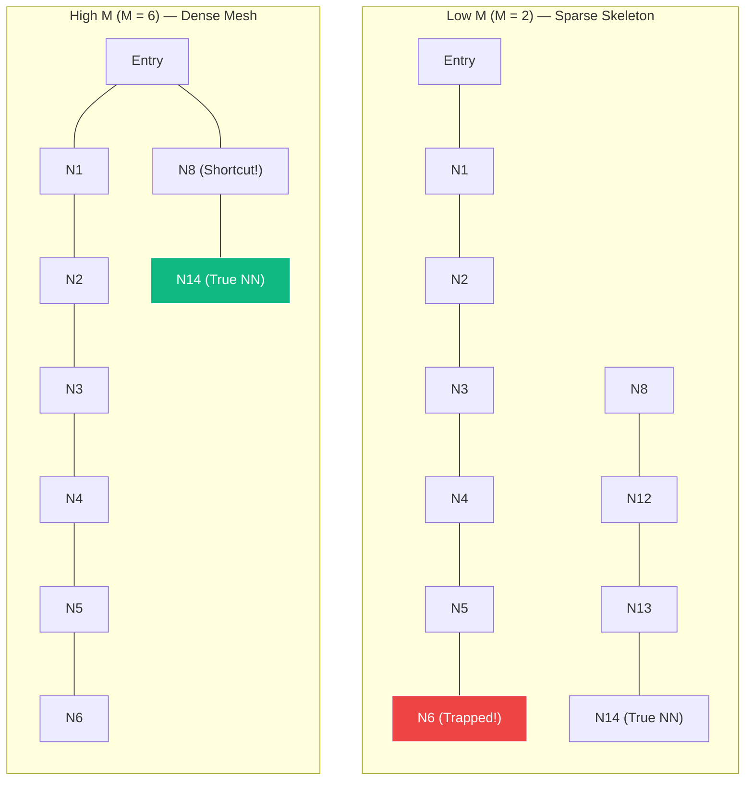

# Tuning HNSW: How Hyperparameters Control the Speed-Accuracy Trade-off

If you have ever initialized an index in a vector database or a library like `faiss`, `hnswlib`, or `pgvector`, you have encountered three mysterious configuration parameters: **$M$**, **$ef_{\text{construction}}$**, and **$ef_{\text{search}}$**.

You could run HNSW right out of the box using default values—but defaults are just a generic compromise. Two numbers control the physical architecture of the graph, and one controls how aggressively it is searched. Change them, and you get a completely different search engine.

In this article, we dive deep into HNSW’s tuning dials, using our accompanying split-screen animations to make the concrete trade-offs between **Memory, Latency, and Recall** completely visible.

---

## The Vector Search Trade-off Triangle

Vector search is governed by an inescapable three-way trade-off. You can optimize for any two, but always at the expense of the third:

```txt
               [ Search Latency (Speed) ]
                        /     \
                       /       \
                      /  HNSW   \
                     /  Tuning   \
                    /    Space    \
                   /               \
[ Recall Accuracy ] ----------------- [ Memory & Build Time ]
```

1. **Recall Accuracy**: The percentage of queries that successfully return the true, mathematically absolute nearest neighbors.
2. **Search Latency (Speed)**: How many queries your database can execute per second (QPS).
3. **Memory & Build Time**: The RAM footprint of the index and the time it takes to build the graph.

HNSW's genius is that it is completely tunable. By adjusting the hyperparameters, you can configure HNSW to act as a **lightning-fast approximate cache** (low memory, high speed, moderate recall) or as a **surgical, high-precision retrieval system** (high memory, 99.9% recall).

---

## 1. The Tuning Knobs (The Dashboard)

Let's define the knobs before we turn them. As shown in our dashboard animation:

```txt
+-------------------------------------------------------------+
|                     HNSW CONTROL PANEL                      |
|                                                             |
|  [M] (Max Connections)    O-------=============  [ M = 16 ] |
|  -> Controls graph skeleton and edge density.                |
|                                                             |
|  [ef] (Search Beam Size)  -O-------------------  [ ef = 10 ]|
|  -> Controls candidate queue size.                          |
|     - ef_construction : queue size during index building    |
|     - ef_search       : queue size during active queries    |
+-------------------------------------------------------------+
```

### $M$ (Max Connections per Node)

- **What it does**: Defines the hard budget of maximum bi-directional connections each node can form on the base layer (Layer 0). High layers automatically receive a budget of $M_{\max0} = 2M$.
- **Typical Range**: `2` to `64` (defaults usually hover around `16`).

### $ef$ (Candidate Queue Size)

- **What it does**: The size of the dynamic, sorted priority queue that holds unexplored candidate nodes during graph traversal.
- **$ef_{\text{construction}}$**: The queue size used **during index building**. It determines how thoroughly a new vector searches the graph to find its entry connections.
- **$ef_{\text{search}}$**: The queue size used **during query time**. It controls the "beam width" of the active nearest neighbor search.
- **Typical Range**: `1` to `500`+.

---

## 2. The $M$ Parameter — Edge Density & Shortcuts

To see the physical effect of $M$, we conduct a split-screen experiment. We insert the **exact same 15 data points** into two databases and run an identical query $Q$. The only difference is the connection budget $M$:

### The Split-Screen Comparison



### Low M ($M=2$): The Sparse Highway Trap

With $M=2$, each node is extremely limited. The resulting graph is a series of long, isolated coordinate chains:

- **The Searcher’s Walk**: Starting at the `Entry` node, the searcher has no choice but to step slowly down the chain: `Entry -> N1 -> N2 -> N3 -> N4 -> N5 -> N6`.
- **The Failure**: At node `N6`, the searcher halts. Every neighbor of `N6` is farther from query $Q$ than `N6` itself. The searcher is trapped in a **local minimum**, completely unaware that the true nearest neighbor (`N14`) is sitting just across a small gap.
- **Trade-off**: Minimal RAM footprint, but high risk of recall failure due to isolated neighborhoods.

### High M ($M=6$): Long-Range Shortcuts

With $M=6$, nodes can form multiple edges, weaving a densely connected small-world mesh:

- **The Searcher’s Walk**: Starting at the same `Entry` node, the searcher immediately detects a long-range shortcut edge to `N8` and leaps across the graph: `Entry -> N8`.
- **The Success**: From `N8`, the searcher forms an edge directly to `N14` (the true nearest neighbor). The target is found in exactly **2 hops**.
- **Trade-off**: High recall and lightning-fast search routing, but at the cost of significantly higher memory consumption and slower edge-distance calculations (since every step evaluates 6 neighbor vectors instead of 2).

---

## 3. The $ef$ Parameter — Greedy vs. Beam Search

Next, we look at the search effort parameter, $ef_{\text{search}}$. To make the visual comparison perfect, we run the search on two **completely identical graphs** blocked by a crescent barrier. Our target query $Q$ sits in the pocket behind the barrier:

```txt
               (Entry)
               /  |  \
              /   |   \
            (B1) (B2) (B4)
             \    |    /
              \   |   /
                (B3) <--- Crescent Center (Local Minimum)


               (TrueNN) <--- Query Q is here!
```

### Greedy Search ($ef_{\text{search}} = 1$)

- **The Mechanics**: With $ef=1$, the candidate priority queue can hold at most **1 item**. The searcher is strictly greedy—it evaluates neighbors, chooses the absolute closest, and instantly discards the rest.
- **The Trap**: The searcher steps from `Entry` to `B3` (the tip of the crescent). Once at `B3`, it probes its neighbors `B2` and `B4`. Because the crescent curves away from the target, both `B2` and `B4` are farther from query $Q$ than `B3` is.
- **The Halt**: Since no neighbor is closer than `B3`, and the queue capacity is 1, the searcher has no memory of alternate routes. It stops dead at `B3`. **Recall fails**.

### Beam Search ($ef_{\text{search}} = 4$)

- **The Mechanics**: With $ef=4$, the searcher maintains a sorted candidate queue holding up to **4 candidates**.
- **The Queue Walk**:
  1. From `Entry`, the searcher probes the crescent. It pushes all neighbors to the queue. The queue sorts them: `[B3: d=2.10, B2: d=2.40, B4: d=2.40, B1: d=3.20]`.
  2. The searcher pops the closest candidate `B3` and moves to it.
  3. At `B3`, it probes neighbors and realizes they are further. Under greedy search, this was the end. But here, the candidate queue still holds `B2`, `B4`, and `B1`!
  4. **The Backtrack**: The algorithm pops `B3` from the queue, immediately backtracks to the next best candidate (`B2`), and jumps there.
  5. From `B2`, it probes `C1` (which is closer to $Q$, bypasses the crescent tip).
  6. The searcher flows smoothly around the barrier: `B2 -> C1 -> C2 -> TrueNN`.
- **The Success**: The true nearest neighbor is found by using a live queue memory to escape a local minimum.

---

## 4. Understanding $ef_{\text{construction}}$

While $ef_{\text{search}}$ controls the queue size during active queries, **$ef_{\text{construction}}$** controls the queue size **when the index is being built**.

When inserting a new vector, HNSW searches the existing index to find the best nodes to form edges with.

- If $ef_{\text{construction}}$ is **low**, the insertions use a small queue (greedy search). The index builds incredibly fast, but the graph is wired poorly—leaving isolated neighborhoods and dead ends.
- If $ef_{\text{construction}}$ is **high**, each node search is extremely thorough. The build time is significantly slower, but the resulting graph is perfectly connected, maximizing navigation efficiency.

---

## The Ultimate Tuning Cheat Sheet

Use this reference table to map out your index configurations based on your business requirements:

| Parameter                      | Tuning Action                        | Effect on Recall                           | Effect on Latency (Speed)                         | Effect on Memory / Build                          | Practical Use Case                                                                    |
| :----------------------------- | :----------------------------------- | :----------------------------------------- | :------------------------------------------------ | :------------------------------------------------ | :------------------------------------------------------------------------------------ |
| **$M$**                        | **Increase ↑**<br/>_(e.g., 32–64)_   | **High Increase**<br/>(fewer local minima) | **Moderate Speedup**<br/>(more shortcut paths)    | **High Cost**<br/>(more RAM per node)             | **High-Dimensional Embeddings**<br/>(Image/Video retrieval, complex cross-attention)  |
| **$M$**                        | **Decrease ↓**<br/>_(e.g., 4–8)_     | **Decrease**<br/>(isolated neighborhoods)  | **Slower Routing**<br/>(longer paths)             | **High Savings**<br/>(sleek index footprint)      | **Edge Devices / Low RAM**<br/>(mobile apps, massive sparse document indices)         |
| **$ef_{\text{construction}}$** | **Increase ↑**<br/>_(e.g., 200–400)_ | **Increase**<br/>(high-quality wiring)     | **Slight Speedup**<br/>(better graph routing)     | **Slower Build Time**<br/>(long indexing runs)    | **Static / Read-Heavy Indices**<br/>(offline product catalogs, curated encyclopedias) |
| **$ef_{\text{construction}}$** | **Decrease ↓**<br/>_(e.g., 32–64)_   | **Decrease**<br/>(poor graph quality)      | **Slight Increase**<br/>(convoluted search paths) | **Ultra-Fast Indexing**<br/>(near instant builds) | **Dynamic / Write-Heavy Indices**<br/>(real-time streaming feeds, news index)         |
| **$ef_{\text{search}}$**       | **Increase ↑**<br/>_(e.g., 64–200)_  | **Increase**<br/>(exhaustive search)       | **High Cost**<br/>(lower queries/sec)             | **No RAM Cost**<br/>(temporary query memory)      | **High-Precision Retrieval**<br/>(financial audit logs, legal RAG search engines)     |
| **$ef_{\text{search}}$**       | **Decrease ↓**<br/>_(e.g., 10–32)_   | **Decrease**<br/>(greedy traps)            | **Ultra-Fast**<br/>(massive QPS speedup)          | **No RAM Cost**                                   | **Low-Latency Search**<br/>(search autocomplete, real-time recommenders)              |

---

## Conclusion: Tunable Genius

The power of HNSW does not lie in a single, rigid graph layout. **It lies in its flexibility.**

By tuning $M$, $ef_{\text{construction}}$, and $ef_{\text{search}}$, you are in complete control of the trade-off boundaries. You can construct a dense, high-quality skeleton, and then dial $ef_{\text{search}}$ up or down dynamically depending on whether your server is experiencing high traffic (requiring speed) or quiet hours (allowing maximum precision).

Tuning these knobs is the difference between running HNSW out of the box and engineering a bespoke, state-of-the-art vector retrieval solution.
