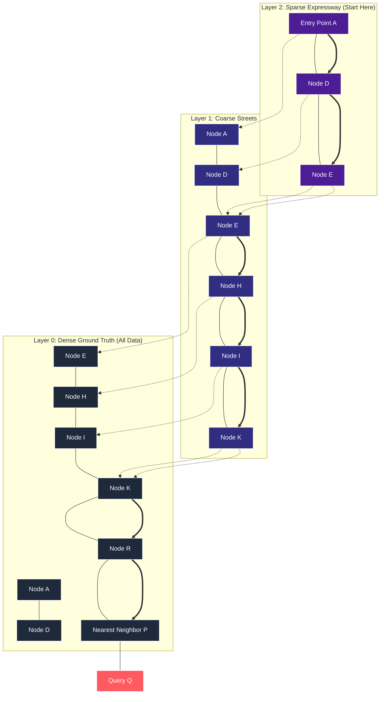
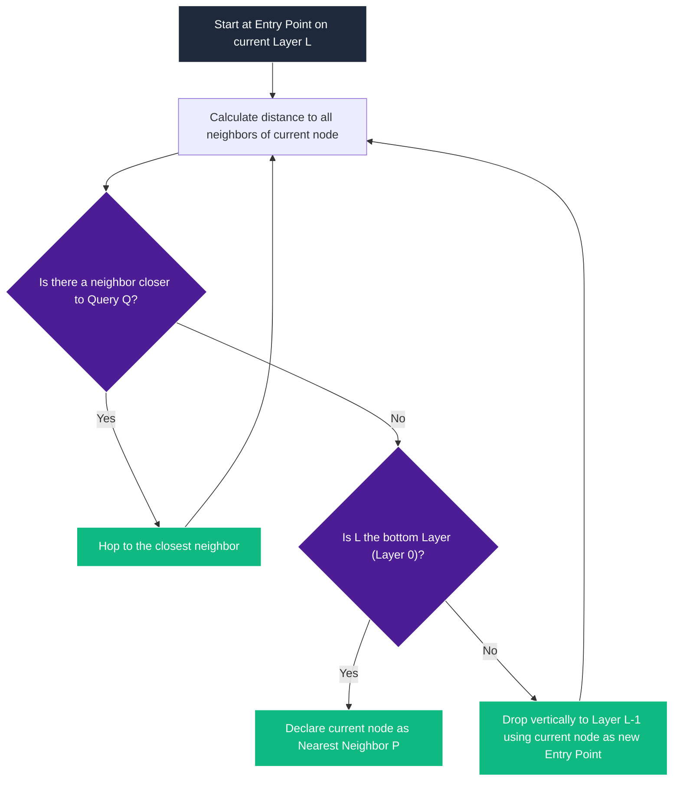

# Demystifying HNSW: How Hierarchical Navigable Small World Graphs are Searched

If you have ever wondered how vector databases retrieve a needle-in-a-haystack vector out of millions of high-dimensional embeddings in **microseconds**, the secret lies in the routing.

While building an HNSW (Hierarchical Navigable Small World) index is half the magic, **searching** it is where the performance rubber meets the road. In a flat vector space, finding the nearest neighbor requires a linear scan—comparing your query to _every single vector_ in the database ($\mathcal{O}(N)$ complexity). HNSW turns this into a logarithmic highway traversal ($\mathcal{O}(\log N)$), resolving queries with absolute mathematical elegance.

This article is the companion guide to our **HNSW Search Animation**. It breaks down the exact routing trajectory, distance metrics, and structural mechanics of how HNSW travels down layers to isolate the nearest neighbor in milliseconds.

---

## The Core Concept: Multi-Tiered Expressway Routing

HNSW structures the vector space as a vertically stacked stack of layers, mimicking a **probabilistic skip-list**.

Instead of searching the entire dense base graph at once, the searcher starts at the absolute top layer (which is highly sparse) and hops wide distances, narrowing down the geometric coordinate window before dropping down to denser layers below.

---

## The Search Routing Algorithm

The search relies on a highly optimized **Greedy Walk**. At each node, the searcher calculates the distance between the query point $Q$ and all connected neighbors of the current node. It only moves if it finds a neighbor that is _strictly closer_ to $Q$ than the current node.

The decision flow of the greedy walk is represented below:

---

## Step-by-Step Walkthrough of the Animation

Let’s trace the exact search trajectory from our accompanying animation.
Our Target Query Point is **$Q$** located at coordinates **$[3.0, -2.0]$**.

### Scene 1: Sparse Top Layer (Layer 2)

The searcher initiates the traversal at **Node $A$** (the entry point for the top layer).

1. **At Node $A$** ($[-3.0, 2.5]$, distance to $Q \approx 7.50$):

- Probes neighbor **$D$** ($[-1.0, 2.0]$, distance to $Q \approx 5.66$).
- Since $5.66 < 7.50$ (closer), the searcher hops: **$A \to D$**. 2. **At Node $D$** ($[-1.0, 2.0]$):
- Probes neighbor **$E$** ($[-0.5, 0.5]$, distance to $Q \approx 4.30$).
- Since $4.30 < 5.66$ (closer), the searcher hops: **$D \to E$**. 3. **At Node $E$** ($[-0.5, 0.5]$):
- Probes neighbors **$D$** ($5.66$) and **$X$** ($[-2.0, -1.0]$, distance to $Q \approx 5.10$).
- None of the neighbors are closer than $E$'s current distance of $4.30$.
- **Local Minimum Reached**: The searcher halts at $E$ and declares it the local minimum on $L_2$.

Search cost on $L_2$: **2 hops**.

---

### Scene 2 & 3: Refinement on Layer 1

The searcher drops vertically from Node $E$ on Layer 2 to Node $E$ on Layer 1. The camera zooms in around $E$ to reveal coarser local connections.

4. **At Node $E$** ($[-0.5, 0.5]$):

- Probes neighbors **$D$** ($5.66$), **$X$** ($5.10$), and **$H$** ($[0.5, 0.2]$, distance to $Q \approx 3.33$).
- Since $3.33 < 4.30$, the searcher hops to the closest neighbor: **$E \to H$**. 5. **At Node $H$** ($[0.5, 0.2]$):
- Probes neighbor **$I$** ($[1.2, -0.4]$, distance to $Q \approx 2.41$).
- Since $2.41 < 3.33$, the searcher hops: **$H \to I$**. 6. **At Node $I$** ($[1.2, -0.4]$):
- Probes neighbor **$K$** ($[1.8, -0.6]$, distance to $Q \approx 1.84$).
- Since $1.84 < 2.41$, the searcher hops: **$I \to K$**. 7. **At Node $K$** ($[1.8, -0.6]$):
- Probes neighbors **$I$** ($2.41$), **$Y$** ($[1.0, -1.5]$, distance to $Q \approx 2.06$), and **$Z$** ($[2.5, 0.5]$, distance to $Q \approx 2.55$).
- None of these neighbors are closer than $K$'s current distance of $1.84$.
- **Local Minimum Reached**: The searcher stops at $K$ on Layer 1.

Search cost on $L_1$: **3 hops**.

---

### Scene 4: Dense Base Layer (Layer 0)

The searcher drops vertically from $K$ on Layer 1 to $K$ on Layer 0. The camera zooms in significantly to reveal the dense, cluttered ground-truth graph.

8. **At Node $K$** ($[1.8, -0.6]$):

- Probes neighbors **$I$** ($2.41$), **$Y$** ($2.06$), **$Z$** ($2.55$), and **$R$** ($[2.4, -1.2]$, distance to $Q \approx 1.00$).
- Since $1.00 < 1.84$, the searcher hops: **$K \to R$**. 9. **At Node $R$** ($[2.4, -1.2]$):
- Probes neighbor **$P$** ($[2.7, -1.6]$, distance to $Q \approx 0.50$).
- Since $0.50 < 1.00$, the searcher hops: **$R \to P$**. 10. **At Node $P$** ($[2.7, -1.6]$):
- Probes neighbors **$R$** ($1.00$) and **$C_6$** ($[3.0, 1.0]$, distance to $Q \approx 3.00$).
- None of the neighbors are closer than $0.50$.
- **Global Nearest Neighbor Isolated**: The searcher declares **Node $P$** as the final nearest neighbor to $Q$!

Search cost on $L_0$: **2 hops**.

---

## Performance Comparison: HNSW vs. Flat Linear Scan

To understand why HNSW is so revolutionary, let us contrast the computational profile of this search versus a naive flat search over a medium-sized dataset of **1,000,000 vectors**:

| Metric                          | Flat Linear Scan (Exact K-NN)                        | HNSW Hierarchical Search (Oours)                             |
| :------------------------------ | :--------------------------------------------------- | :----------------------------------------------------------- |
| **Search Path**                 | Scans every single vector in the index sequentially. | Traverses hierarchical levels from sparse to dense.          |
| **Total Distance Calculations** | **1,000,000 comparisons** (100% of dataset).         | **7 hops** (only 14 nodes wiggled/probed in total!).         |
| **Computational Complexity**    | Linear: $\mathcal{O}(N)$                             | Logarithmic: $\mathcal{O}(\log N)$                           |
| **Execution Latency**           | High (tens of milliseconds, scaling linearly).       | Extremely Low (under 1 millisecond, scales logarithmically). |
| **Search Accuracy**             | 100% Exact Recall.                                   | ~95% to 99% Approximate Recall (tunable via `efSearch`).     |

### The Power of Logarithmic Scaling

In our visual demonstration, the searcher bypassed thousands of nodes and reached the target in exactly **7 routing comparisons**.

As your dataset grows from **1,000,000** to **100,000,000** vectors:

- A flat linear scan will take **100x longer**, requiring 100,000,000 comparisons.
- HNSW will only require a couple of additional hops (increasing search cost from ~7 to ~10 comparisons), maintaining near-constant sub-millisecond latencies.

This hierarchical skip-list routing is what enables modern semantic search engines, LLM retrieval pipelines (RAG), and recommender systems to deliver instantaneous queries across global internet-scale datasets.
