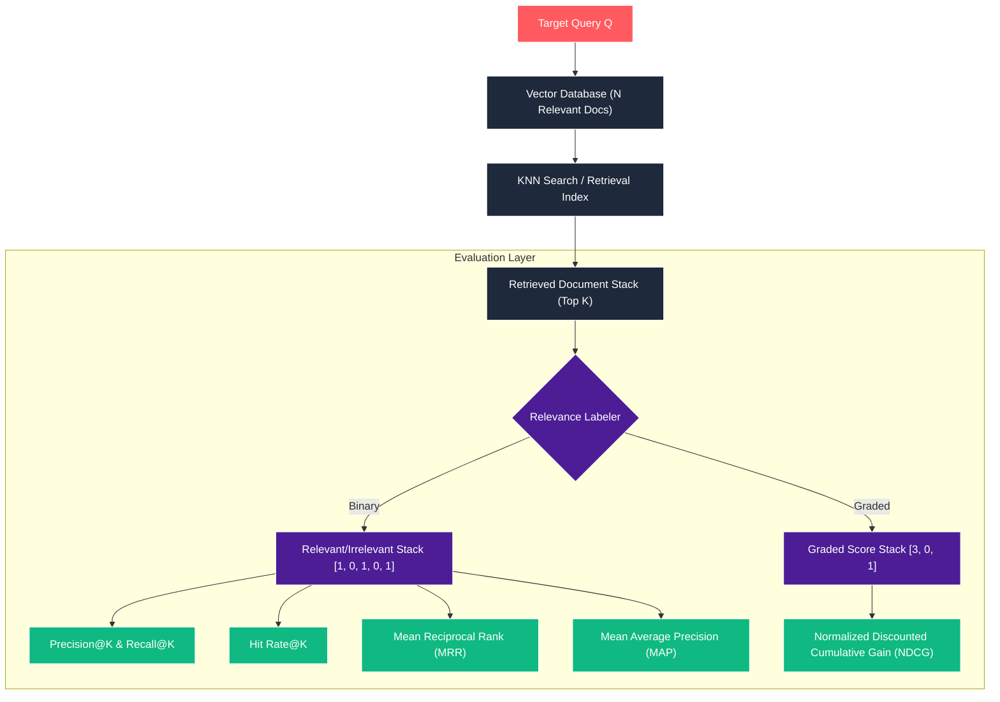

# Evaluative Mechanics: Demystifying Retrieval Metrics for RAG

In Retrieval-Augmented Generation (RAG), the performance of the system is strictly capped by the quality of its retrieval engine. If the retrieval step feeds irrelevant context to the Large Language Model (LLM), the generator will hallucinate, lose context, or generate garbage output.

While vector databases use raw distance metrics (like Cosine Similarity or L2 distance) to index and retrieve vectors, these metrics do not tell us whether the retrieved documents are actually **correct** or **well-ordered** for downstream tasks. To evaluate this, we use traditional Information Retrieval (IR) metrics.

This article is the companion guide to our **RAG Retrieval Metrics Animation**. It breaks down the exact mathematics, visual mechanics, and selection criteria for the six core retrieval metrics: **Precision@K, Recall@K, Hit Rate@K, MRR, MAP, and NDCG**.

---

## The Core Concept: The Retrieval Evaluation Pipeline

The evaluation pipeline takes a query, retrieves the top $K$ documents from a vector index, and compares them against a gold-standard ground truth (the set of known relevant documents in the database).



### Binary vs. Graded Relevance

IR evaluation divides metrics based on how relevance is labeled:

- **Binary Relevance**: A document is either relevant ($1$ or $\checkmark$) or irrelevant ($0$ or $\times$).
- **Graded Relevance**: A document is given a score representing its level of utility (e.g., $3$ = highly relevant, $1$ = partially relevant, $0$ = irrelevant).

---

## Step-by-Step Walkthrough of the Animation Scenes

Let's trace the visual demonstrations and mathematical calculations from our animation.

---

### Scene 1: Introduction to Retrieval Stack

The animation starts by showing how raw retrieved results are converted to evaluated cards:

- An input query vector is sent into a document store.
- Five generic documents are retrieved and stacked in order of distance.
- The evaluation engine assesses each document: Ranks 1, 3, and 5 are marked relevant ($\checkmark$), while Ranks 2 and 4 are marked irrelevant ($\times$).

---

### Scene 2: Precision@K & Recall@K (The Binary Foundation)

This scene illustrates how we measure the **purity** of the retrieved stack vs. its **coverage** of the database.

#### 1. Precision@5

Precision@5 calculates the percentage of retrieved documents that are relevant.

$$\text{Precision@5} = \frac{\text{Relevant Documents in Top 5}}{5} = \frac{3}{5} = 0.60\ (60\%)$$

#### 2. Recall@5

Recall@5 measures the fraction of all relevant database documents ($N=6$) captured in the retrieved stack.

$$\text{Recall@5} = \frac{\text{Relevant Documents in Top 5}}{\text{Total Relevant in DB (N)}} = \frac{3}{6} = 0.50\ (50\%)$$

#### 3. Shuffling (Order Insensitivity)

To demonstrate a key limitation of these basic metrics, the animation shuffles the stack:

- The documents swap places, pushing irrelevant documents to the top.
- The rank labels update to show the new order.
- **Result**: The Precision@5 and Recall@5 calculations remain exactly the same ($0.60$ and $0.50$ respectively).
- **Takeaway**: Precision@K and Recall@K are **order-insensitive** within the top $K$. They do not care if your best result is at Rank 1 or Rank 5.

---

### Scene 3: Hit Rate@K (Vector Search Benchmark)

Hit Rate is a simplified binary metric widely used in vector search benchmarks. It asks a binary question: _Did we retrieve at least one relevant document in our top $K$?_

The animation calculates the Average Hit Rate across a query set of size $|Q|=3$ with $K=3$:

```mermaid
line1["Query 1: [✓, ✗, ✗] -> Hit Rate = 1"]
line2["Query 2: [✗, ✗, ✗] -> Hit Rate = 0"]
line3["Query 3: [✗, ✓, ✗] -> Hit Rate = 1"]
```

$$\text{Average Hit Rate@3} = \frac{1 + 0 + 1}{3} \approx 0.67\ (67\%)$$

- **Use Case**: Hit Rate is excellent for simple search tasks where any single hit is enough to answer the user's query.

---

### Scene 4: Mean Reciprocal Rank (MRR)

MRR is an **order-sensitive** metric designed for navigational searches or single-answer lookups (like factoid question answering). It only cares about the **rank of the first relevant document**.

#### Calculation

The animation compares two queries side-by-side:

- **Query A**: The first relevant hit is at Rank 3. Subsequent hits (like Rank 4) are completely ignored.
  $$\text{RR}_A = \frac{1}{\text{rank}_{\text{first}}} = \frac{1}{3} \approx 0.33$$
- **Query B**: The first relevant hit is at Rank 1.
  $$\text{RR}_B = \frac{1}{1} = 1.00$$

Taking the mean across both queries:

$$\text{MRR} = \frac{\text{RR}_A + \text{RR}_B}{2} = \frac{1/3 + 1.0}{2} = 0.67$$

---

### Scene 5: Mean Average Precision (MAP)

MAP is the standard metric for ranked lists with binary relevance. It evaluates the entire ranking quality by calculating Precision at each relevant rank.

#### 1. Average Precision (AP) for Query A (Good Ranking)

The animation uses a moving pointer to walk down the stack:

- At Rank 1 (Relevant): $\text{P@1} = 1/1 = 1.00$
- At Rank 3 (Relevant): $\text{P@3} = 2/3 \approx 0.67$
- At Rank 5 (Relevant): $\text{P@5} = 3/5 = 0.60$
- Summing and dividing by the number of retrieved relevant documents ($3$):
  $$\text{AP}_A = \frac{1.00 + 0.67 + 0.60}{3} \approx 0.76$$

#### 2. Average Precision (AP) for Query B (Bad Ranking)

Relevant items are pushed down to Ranks 4 and 5:

- At Rank 4 (Relevant): $\text{P@4} = 1/4 = 0.25$
- At Rank 5 (Relevant): $\text{P@5} = 2/5 = 0.40$
  $$\text{AP}_B = \frac{0.25 + 0.40}{3} \approx 0.22$$

#### 3. Mean Average Precision (MAP)

Taking the average across both queries:

$$\text{MAP} = \frac{\text{AP}_A + \text{AP}_B}{2} = \frac{0.76 + 0.22}{2} = 0.49$$

- **Takeaway**: MAP successfully penalizes Query B for delaying relevant results, scoring it $0.22$ vs. Query A's $0.76$.

---

### Scene 6: Normalized Discounted Cumulative Gain (NDCG)

NDCG is used when relevance is **graded** rather than binary. It relies on a logarithmic position discount.

Our animation evaluates the stack `[Score 3 (Highly Relevant), Score 0 (Irrelevant), Score 1 (Partially Relevant)]`:

#### 1. Cumulative Gain (CG)

$$\text{CG} = \sum rel_i = 3 + 0 + 1 = 4$$

#### 2. Discounted Cumulative Gain (DCG)

Each rank is divided by a logarithmic discount term $\log_2(i + 1)$:
$$\text{DCG} = \frac{3}{\log_2(2)} + \frac{0}{\log_2(3)} + \frac{1}{\log_2(4)} = \frac{3}{1.0} + 0 + \frac{1}{2.0} = 3.0 + 0.0 + 0.5 = 3.5$$

#### 3. Ideal DCG (IDCG)

To normalize the score, the animation sorts the cards into the ideal descending order: `[Score 3, Score 1, Score 0]`.
$$\text{IDCG} = \frac{3}{\log_2(2)} + \frac{1}{\log_2(3)} + \frac{0}{\log_2(4)} \approx 3.0 + \frac{1}{1.58} + 0 = 3.0 + 0.63 + 0 = 3.63$$

#### 4. Normalized DCG (NDCG)

$$\text{NDCG} = \frac{\text{DCG}}{\text{IDCG}} = \frac{3.5}{3.63} \approx 0.96$$

---

## Summary Selection Matrix

| Metric                | Relevance | Order Sensitive? | Best Use Case                                                                                                                     |
| :-------------------- | :-------- | :--------------- | :-------------------------------------------------------------------------------------------------------------------------------- |
| **Hit Rate / Recall** | Binary    | No               | **Coverage / Needle-in-a-Haystack**: Evaluates if the necessary source text is loaded in the context window.                      |
| **Precision**         | Binary    | No               | **Purity / Cost Control**: Minimizes noise inside the context window to save tokens and prevent LLM distractions.                 |
| **MRR**               | Binary    | Yes              | **Navigational Search & Factoid Q&A**: Evaluates single-answer lookups where only the first hit matters.                          |
| **MAP**               | Binary    | Yes              | **Ranked Lists / Search Pages**: Optimizes general retrieval ranking where multiple sources are compiled.                         |
| **NDCG**              | Graded    | Yes              | **Highly Nuanced Relevance (Web Search)**: Essential when documents contain degrees of relevance (e.g. key match vs side detail). |
